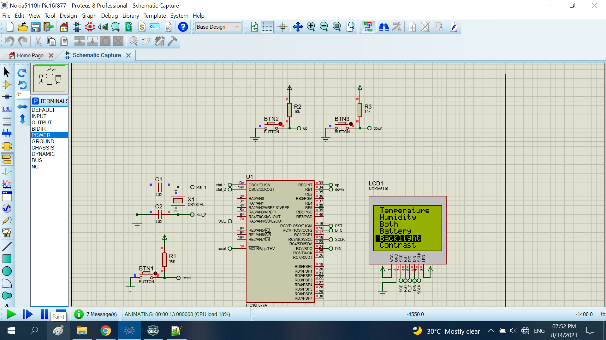

# Nokia5110 in the pic16f877

The project control the nokia5110 by the pic16f877.To control, I using the up-down button.

## Features

- Compiler : mplax 5.50
- Simulation : proteus 8.8
- Atmega328p : F_CPU= 16Hz

## Result

